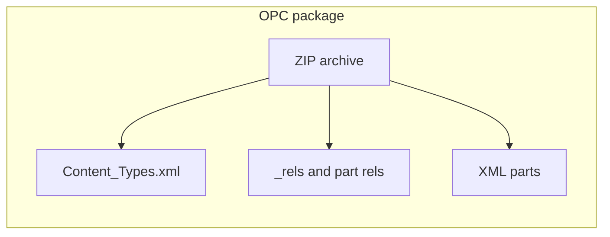

# Architecture

## Big picture

**Office Open XML** files (`.docx`, `.xlsx`, `.pptx`) are **OPC packages**: a **ZIP** archive of **XML parts** plus **relationships** (`.rels`) and a root **`[Content_Types].xml`** that maps part paths to MIME-like content types.

This repository implements that model in Go using **`archive/zip`**, **`encoding/xml`**, and related standard library packages—**no third-party modules** in `go.mod`.

## Go package layout

| Package | Path | Role |
|---------|------|------|
| **ooxml** (internal) | `internal/ooxml` | OPC read path: `Open` / `OpenWithOptions` (zip-bomb limits), part indexing, `[Content_Types].xml` and `.rels` parsing, `ResolveTarget` (no silent path traversal). OPC write path: `PackageWriter` (deterministic ZIP, `[Content_Types].xml` first). Namespace and content-type helpers: `namespaces.go`. |
| **xmlwriter** (internal) | `internal/xmlwriter` | Streaming XML writer with stable namespace prefixes (Word/Excel-friendly), used by markup writers. |
| **opcprops** (internal) | `internal/opcprops` | Parse/emit `docProps/core.xml` and `docProps/app.xml`. |
| **docx** | `docx` | WordprocessingML: open/read/write (currently a **minimal** subset). |
| **xlsx** | `xlsx` | SpreadsheetML: **open/validate** today; write APIs planned. |
| **pptx** | `pptx` | PresentationML: **open/validate** today; write APIs planned. |
| **CLI** | `cmd/office` | Small demo binary; must remain stdlib-only. |

### Import rules

- `internal/ooxml` **must not** import `docx`, `xlsx`, or `pptx`.
- Format packages **may** import `internal/ooxml` only.

Treat `internal/ooxml` as **implementation detail**: evolve it carefully, but do not promise the same stability as exported APIs in `docx` / `xlsx` / `pptx` without a design decision.

## Data flow (read path)

1. Caller provides an `io.ReaderAt` + size (typical: `*os.File` or `bytes.Reader` over an in-memory `.docx`).
2. `internal/ooxml.Open` (or `OpenWithOptions` for custom limits) builds a `zip.Reader`, applies entry-count and declared-size guards, indexes entries, parses `[Content_Types].xml`.
3. Format-specific `Open` (e.g. `docx.Open`) validates the **main part** content type and/or root `officeDocument` relationship.
4. Higher-level APIs read XML parts through `Package.OpenReader` / `ReadFile` (per-part read size is capped when defaults are used).

## Data flow (write path)

**`internal/ooxml.PackageWriter`** is the supported way to emit a valid OPC ZIP (deterministic entry order, `[Content_Types].xml` first, optional `.rels`). Higher-level packages can buffer parts and call `Close()` once metadata is complete.

**`docx.WriteMinimal`** still builds a minimal `.docx` for smoke tests; it can be migrated to `PackageWriter` over time. **XLSX/PPTX writers** are not implemented yet (`ErrNotImplemented`).

Any non-trivial feature (images, sheets, slide layouts) must still satisfy **OPC rules**: correct `[Content_Types].xml`, `_rels/.rels`, and part relationships.

## References

- ECMA-376 / ISO/IEC 29500 (Office Open XML)
- OPC overview: `[Content_Types].xml`, relationship types, part names
- Zip-bomb limits and `archive/zip` behavior: [docs/security/zip-bomb-mitigation.md](security/zip-bomb-mitigation.md)
