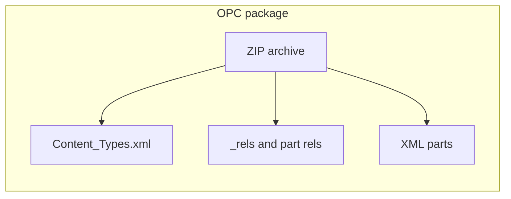

# Architecture

## Big picture

**Office Open XML** files (`.docx`, `.xlsx`, `.pptx`) are **OPC packages**: a **ZIP** archive of **XML parts** plus **relationships** (`.rels`) and a root **`[Content_Types].xml`** that maps part paths to MIME-like content types.

This repository implements that model in Go using **`archive/zip`**, **`encoding/xml`**, and related standard library packages—**no third-party modules** in `go.mod`.

## Go package layout

| Package | Path | Role |
|---------|------|------|
| **ooxml** (internal) | `internal/ooxml` | Open packages, normalize part names, parse `[Content_Types].xml` and `.rels`, resolve relationship targets. |
| **docx** | `docx` | WordprocessingML: open/read/write (currently a **minimal** subset). |
| **xlsx** | `xlsx` | SpreadsheetML: **open/validate** today; write APIs planned. |
| **pptx** | `pptx` | PresentationML: **open/validate** today; write APIs planned. |
| **CLI** | `cmd/office` | Small demo binary; must remain stdlib-only. |

### Import rules

- `internal/ooxml` **must not** import `docx`, `xlsx`, or `pptx`.
- Format packages **may** import `internal/ooxml` only.

Treat `internal/ooxml` as **implementation detail**: evolve it carefully, but do not promise the same stability as exported APIs in `docx` / `xlsx` / `pptx` without a design decision.

## Data flow (read path)

1. Caller provides an `io.ReaderAt` + size (typical: `*os.File` or `bytes.Reader` over an in-memory `.docx`).
2. `internal/ooxml.Open` builds a `zip.Reader`, indexes entries, parses `[Content_Types].xml`.
3. Format-specific `Open` (e.g. `docx.Open`) validates the **main part** content type and/or root `officeDocument` relationship.
4. Higher-level APIs read XML parts through `Package.OpenReader` / `ReadFile`.

## Data flow (write path)

Today, **`docx.WriteMinimal`** constructs a fresh ZIP with the minimal parts Word expects for a trivial document. **XLSX/PPTX writers** are not implemented yet (`ErrNotImplemented`).

Future writers should still go through **OPC rules**: correct `[Content_Types].xml`, `_rels/.rels`, and part relationships for any non-trivial feature (images, sheets, slide layouts).

## References

- ECMA-376 / ISO/IEC 29500 (Office Open XML)
- OPC overview: `[Content_Types].xml`, relationship types, part names
